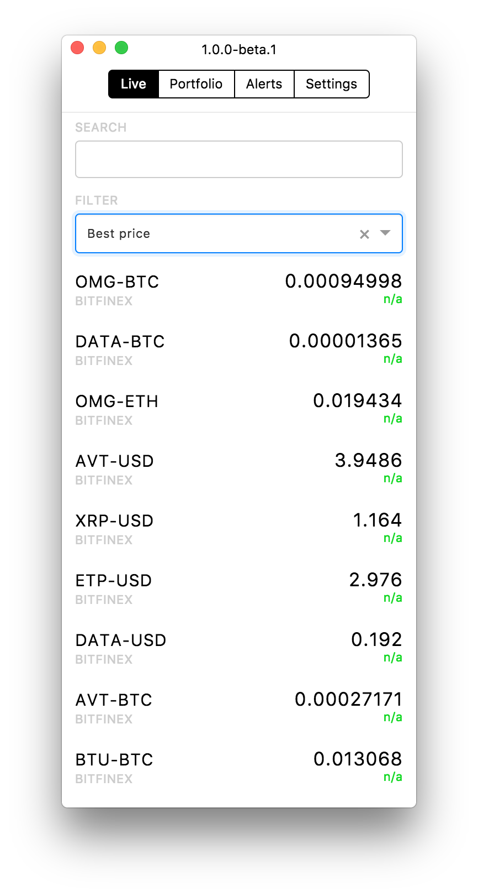
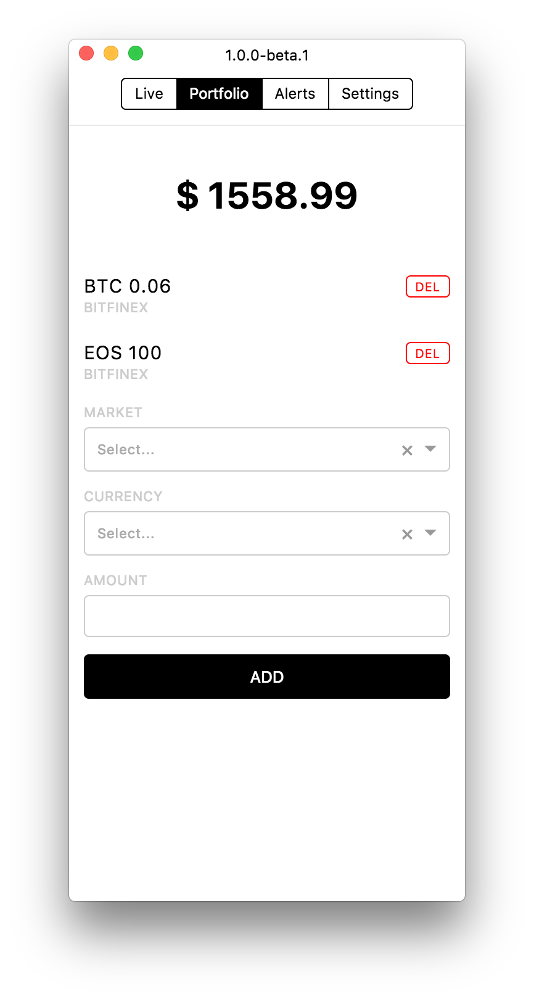
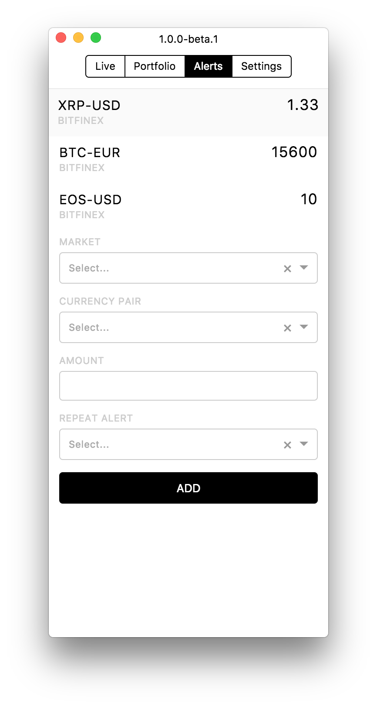

<div align="center">
  
  
  
</div>

### Cryptounicorns Desktop

[](https://travis-ci.org/cryptounicorns/desktop)

Cryptounicorns Desktop is a cryptocurrency price tracking app. It is designed to work with multiple (possibly a lot) exchanges, allowing you to gain instights about price fluctuations at rapid pace. Long-term goal is to make approachable interface for vast majority of exchange markets.

### API

Current api root is `cryptounicorns.io` (about to change to `dev.cryptounicorns.io`, though):

##### Websocker stream

```
ws://%API_ROOT%/api/v1/tickers-changes/stream
```

##### Http endpoint with initial state

```
http://%API_ROOT%/api/v1/tickers-changes
```

##### Price changes API

TODO

### Development

To start working in development mode you got to have and `boot`, and `electron` installed on your machine. This tutorial doesn't assume you use any particular text editor, so if you use Vim or Emacs and looking for advanced REPL features YMMV.

In first tab run:

```
boot watch dev-build
```

After compilation of ClojureScript is complete, in second tab run:

```
electron target/
```

At this point you can connect to `boot` REPL, and execute `(start-repl)` command:

```
boot repl -c
boot.user=> (start-repl)
```

## Code style

### Lint and check

This is more like reference, not requirement.

```
boot check-sources
```

### Format code

This runs as pre-commit hook.

```
boot fmt --git --mode overwrite --really --options '{:style :community :map {:comma? false} :vector {:wrap? false}}'
```

## Deploy and packaging

This is not implemented yet. We are looking for you feedback and help (especially from windows folks)

### Packaging

We probably go with [`electron-packager`](https://github.com/maxogden/electron-packager) for packaging, which offers this kind of workflow:

```
electron-packager target/ APP_NAME --platform=darwin --arch=x64 --version=VERSION
```

### Roadmap

1. Top priority is adding more markets, but this is a [backend task](https://github.com/cryptounicorns/trade)

2. Chart feature missing at the moment, but we are definitely looking to get it as soon as possible

3. Migrate towards [re-frame](https://github.com/Day8/re-frame). At the inception it seemed like overkill, but as project matures, seems like we should have some more idiomatic code.
